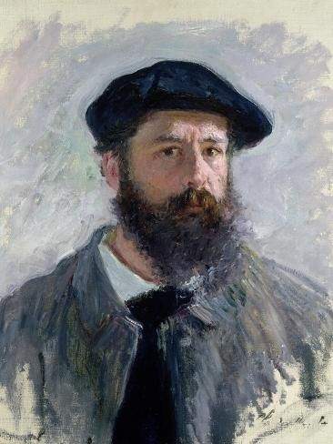
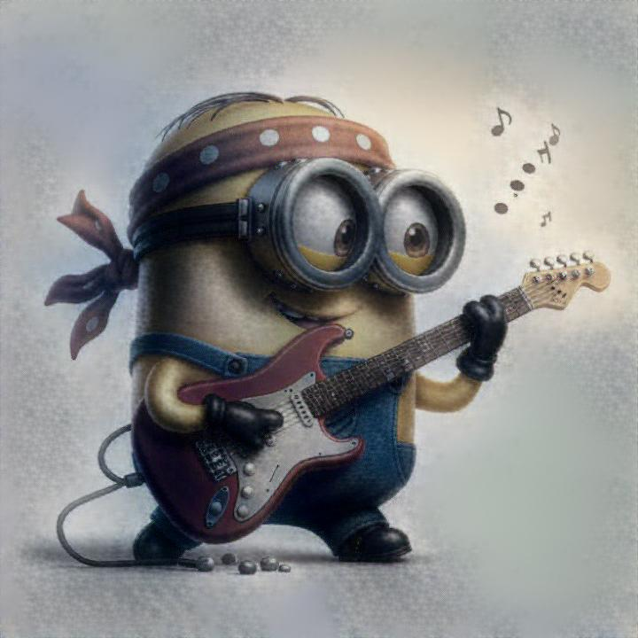
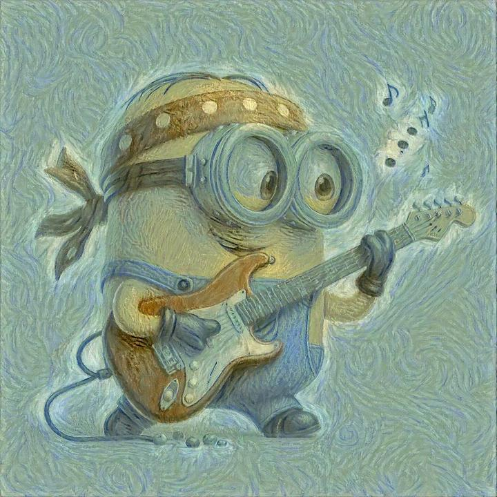
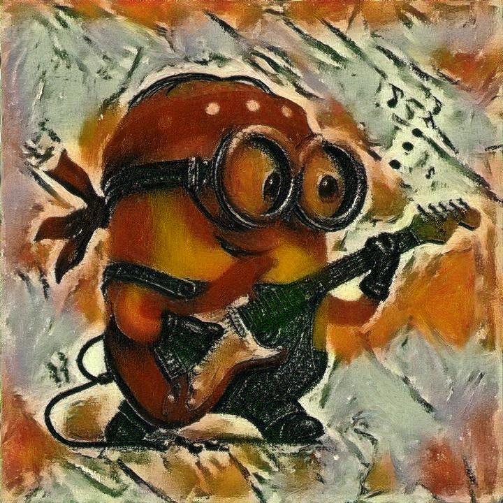

## Overview

This repository is on using two different approaches for doing **neural style (nst) transfer**. Code is implemented using **Ubuntu** system with **Python 3.10.14**. [iCartoonFace Dataset](https://github.com/luxiangju-PersonAI/iCartoonFace) is used for fast NST. More implementation detail can be found at this [blog post](https://lihanlian.github.io/posts/blog4). 

**Content image**

<p align="center">
  
  
</p>

**Style image**
<p align="center">
  
  
  
</p>

<!-- **Basic NST Output**
<figure style="display: block; margin-left: auto; margin-right: auto; width: 100%;">
  
  
  
  <figcaption style="text-align: center;">a = 1 for all, b = 0.01, 100, 100000 from left to right</figcaption>
</figure> -->

**Basic NST Output**

<!-- <table>
  <tr>
    <td></td>
    <td></td>
    <td></td>
  </tr>
  <tr>
    <td colspan="3" style="text-align: center;">
      <figcaption>    a = 1 for all, b = 0.01, 100, 100000 from left to right</figcaption>
    </td>
  </tr>
</table> -->

**Basic NST Output**

<table>
  <tr>
    <td></td>
    <td></td>
    <td></td>
  </tr>
  <tr>
    <td colspan="3" style="text-align: center;">
      <div style="display: flex; justify-content: center;">
        a = 1 for all, b = 0.01, 100, 100000 from left to right
      </div>
    </td>
  </tr>
</table>


<!-- **Basic NST Output**

<table>
  <tr>
    <td></td>
    <td></td>
    <td></td>
  </tr>
</table>

<figcaption style="text-align: center;">a = 1 for all, b = 0.01, 100, 100000 from left to right</figcaption> -->


**Fast NST Output**

<figure style="display: block; margin-left: auto; margin-right: auto; width: 100%;">
  
  
  
  <figcaption style="text-align: center;">a = 1 for all, b = 10000, 10000, 50000 from left to right</figcaption>
</figure>

<figure style="display: block; margin-left: auto; margin-right: auto; width: 100%;">
  
  
  
  <figcaption style="text-align: center;">a = 1 for all, b = 10000, 10000, 50000 from left to right</figcaption>
</figure>

## Run Locally

Clone the project

```bash
  git clone https://github.com/lihanlian/basic-and-fast-neural-style-transfer
```

Go to project directory

```bash
  python3 -m venv env && source env/bin/activate 
```
```bash
  pip install -r requirements.txt
```

 - run _basic_nst.py_ to generate images using the basic neural style transfer algorithm.
 - run _fast_nst_training.py_ to train the feedforward convolutional neural network using fast neural style transfer algorithm.
 - run _fast_nst_inference.py_ to generate images that produced by trained model from _fast_nst_train.py_.
 - _fast_nst_transformer_net.py_ defines the neural network that is trained and later used for inference (generate images).
 - _fast_nst_vgg_net.py_ defines the neural network (based on pre-trained VGG19) for calculating the loss function during training.

## References
 1. [Gatys, Leon A., Alexander S. Ecker, and Matthias Bethge. "A Neural Algorithm of Artistic Style." arXiv preprint arXiv:1508.06576 (2015)](https://arxiv.org/abs/1508.06576) (Basic NST Paper)
 2. [Neural Style Transfer (NST) — theory and implementation](https://medium.com/@ferlatti.aldo/neural-style-transfer-nst-theory-and-implementation-c26728cf969d) (Basic NST Blog Post)
 3. [Johnson, Justin and Alahi, Alexandre and Li, Fei-Fei. "Perceptual losses for real-time style transfer and super-resolution." European Conference on Computer Vision. 2016](https://arxiv.org/abs/1603.08155) (Fast NST Paper)
 4. [pytorch/examples/fast_neural_style](https://github.com/pytorch/examples/tree/main/fast_neural_style) (Fast BST Implementation)
 5. [Downsampling and Upsampling of Images — Demystifying the Theory](https://medium.com/analytics-vidhya/downsampling-and-upsampling-of-images-demystifying-the-theory-4ca7e21db24a)
 6. Gary B. Huang, Manu Ramesh, Tamara Berg, and Erik Learned-Miller. *Labeled Faces in the Wild: A Database for Studying Face Recognition in Unconstrained Environments.* University of Massachusetts, Amherst, Technical Report 07-49, October, 2007. [Link](http://vis-www.cs.umass.edu/lfw/)
 7. [iCartoonFace Dataset](https://github.com/luxiangju-PersonAI/iCartoonFace)


## License

[MIT](https://github.com/lihanlian/basic-and-fast-neural-style-transfer/blob/main/LICENSE)